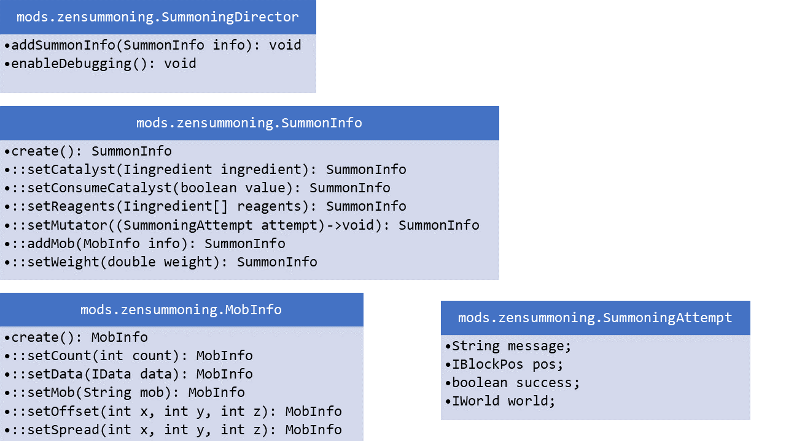

# ZenSummoning [](https://minecraft.curseforge.com/projects/zen-summoning)
A mod that allows for pack creators to set up custom summoning situations using ZenScript

## Example Script
```ZenScript
import crafttweaker.item.IItemStack;
import crafttweaker.item.IIngredient;
import mods.zensummoning.SummoningDirector;
import mods.zensummoning.SummoningAttempt;
import mods.zensummoning.SummoningInfo;
import mods.zensummoning.MobInfo;

SummoningDirector.enableDebugging();
SummoningDirector.addSummonInfo(
    SummoningInfo.create()
        .setCatalyst(<minecraft:stick>)
        .setConsumeCatalyst(false)
        .setReagents([<minecraft:stone>, <minecraft:egg>*12])
        .addMob(MobInfo.create()
            .setMob("minecraft:cow")
            .setCount(4)
            .setOffset(0,4,0)
            .setSpread(1,1,1)
            .setData({"Health": 200, "Attributes":[{"Name":"generic.maxHealth","Base":200}]})
        )
        .addMob(MobInfo.create()
            .setMob("minecraft:blaze")
            .setCount(10)
            .setOffset(0,8,0)
            .setSpread(3,3,3)
            .setData({"Health": 2, "Attributes":[{"Name":"generic.maxHealth","Base":2}]})
        )
        .setMutator(function (attempt as SummoningAttempt) {
            if (attempt.world.raining) {
                attempt.success = false;
                attempt.message = "Can't summon this in the rain!";
            } else {
                attempt.message = "Woohoo!";
            }
        })
);

SummoningDirector.addSummonInfo(
    SummoningInfo.create()
        .setCatalyst(<minecraft:stone>*4)
        .setReagents([<minecraft:ladder>*512])
        .addMob(MobInfo.create()
            .setMob("minecraft:chicken")
        )
);
```
The second example gives a minimum-setup use case

The `SummoningAttempt` object has four properties:

```java
boolean success;
String message;
World world;
BlockPos pos;
```

Setting `success=false` will cancel an otherwise valid summoning attempt.

Setting the `message` property will set the string to be displayed to the user when their attempt either succeeds or fails.

[Example video](https://streamable.com/hflui)

[Another](https://streamable.com/snlbk)

[Another](https://streamable.com/7ay4r)




An example using weighted summoning, where both the catalysts and the reagents must be the same.
```zenscript

SummoningDirector.addSummonInfo(
    SummoningInfo.create()
        .setCatalyst(<minecraft:pumpkin>*3)
        .setReagents([<minecraft:iron_ingot>*2, <minecraft:snow>*2, <minecraft:iron_bars>*2])
        .addMob(MobInfo.create()
            .setMob("minecraft:blaze")
        )
        .setWeight(0.5)
    .setMutator(function (attempt as SummoningAttempt) {
        if (attempt.world.raining) {
            attempt.success = false;
            attempt.message = "test!";
        }
    })
);

SummoningDirector.addSummonInfo(
    SummoningInfo.create()
        .setCatalyst(<minecraft:pumpkin>*3)
        .setReagents([<minecraft:iron_ingot>*2, <minecraft:snow>*2, <minecraft:iron_bars>*2])
        .addMob(MobInfo.create()
            .setMob("minecraft:cow")
        )
        .setWeight(2)
    .setMutator(function (attempt as SummoningAttempt) {
        if (attempt.world.raining) {
            attempt.success = false;
            attempt.message = "test!";
        }
    })
);
```